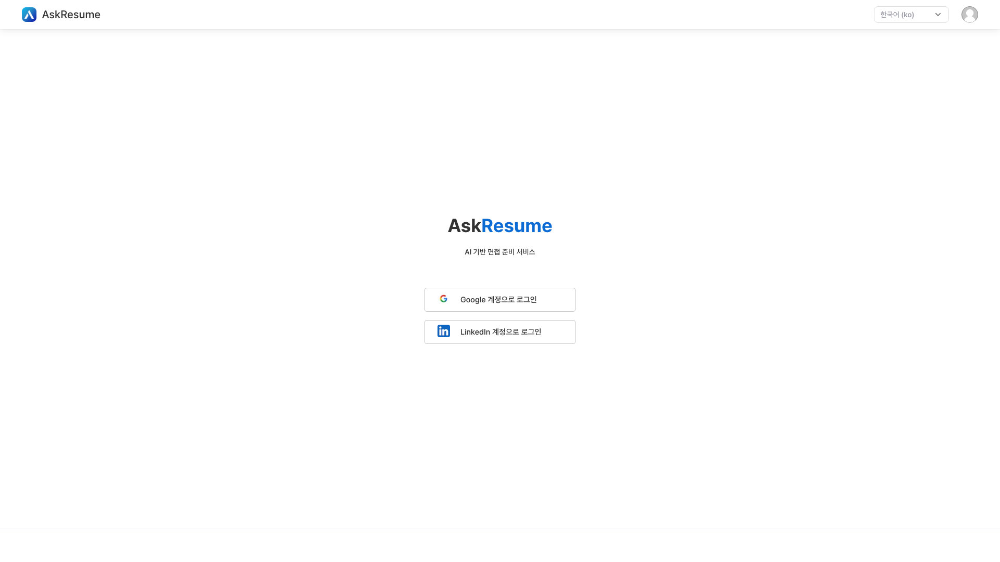
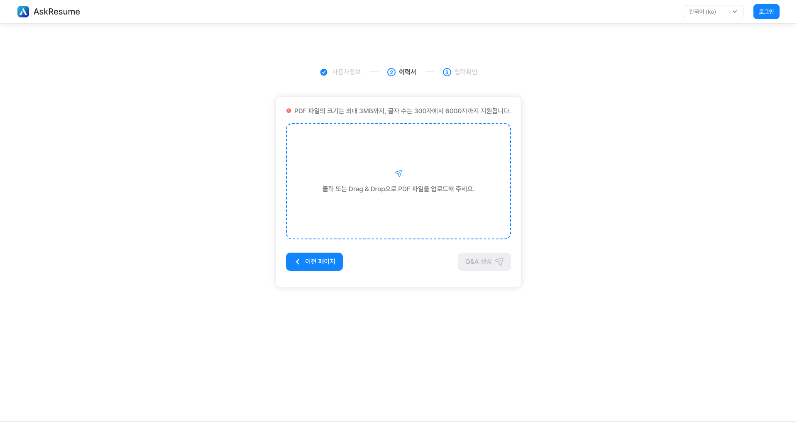

# Ask Resume - 이력서에 대한 인터뷰 질문 및 답변 생성기

이 서비스는 이력서 인터뷰 질문과 답변을 생성하는 LLM 서비스입니다.

이 서비스에는 GPT-3.5-Turbo 모델을 사용했습니다. GPT-3.5-Turbo는 인기 있는 ChatGPT를 지원하는 OpenAI의 언어 모델입니다.

이력서를 입력하고 면접에 나올만한 질문과 그에 대한 답변을 확인해보세요!

> 프론트엔드 리포지토리: https://github.com/dev-redo/ask-resume-front

> 백엔드 리포지토리: https://github.com/132262B/ask-resume-backend

 

# 어떻게 사용하나요?

1. 랜딩 페이지에서 버튼을 클릭하면 이력서를 입력할 수 있는 양식 페이지로 이동합니다.

2. 폼 페이지에서 인적사항(희망직업, 경력 등)과 이력서를 입력합니다.  
   (참고: 언어를 변경하면 새로고침되며 입력한 값이 사라질 수 있습니다!)

3. 입력 후 제출하면 이력서에서 질문과 가능한 답변이 생성됩니다. 생성된 결과는 txt 파일로 저장할 수 있습니다.

 

## 사용 예시

https://github.com/dev-redo/ask-resume-front/assets/69149030/49128374-77d7-4e2b-ba5a-0abc6701d5aa

 

# 주의사항

## 1. 왜 결과를 생성하는데 문제가 발생하나요?

이력서를 입력하고 결과를 생성하면 서버 오류(HTTP 상태 500)가 발생할 수 있습니다.

죄송합니다, 이 오류는 GPT 서버에서 요청이 많이 들어올 때 요청을 차단하기 때문에 발생합니다.  
따라서 임시방편으로 문제 발생 시 재요청이 가능하도록 구현하였습니다.

최대한 빨리 문제를 해결하도록 노력하겠습니다. 불편을 드려 정말로 죄송합니다.

 

# 영감을 받은 리포지토리

이 서비스는 [DevPort](https://github.com/custardcream98/DevPort)와 [gpt4-pdf-chatbot-langchain](https://github.com/mayooear/gpt4-pdf-chatbot-langchain)에서 영감을 받아 제작하였습니다.

 

# 연락

사용 중 오류를 발견하거나 원하는 기능이 있는 경우 [Discord](https://discord.gg/aTzGNZ3y)로 문의하거나 Issue를 작성해주세요!
